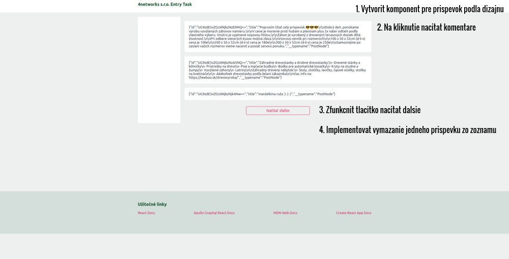
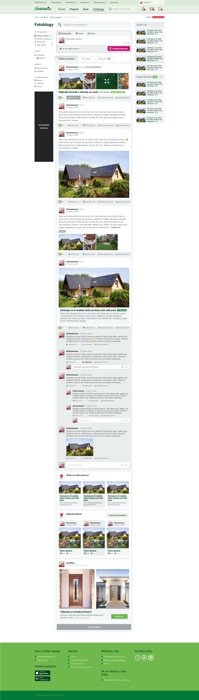

## Instalation

#### JS project

```
> git clone git@github.com:OHUSAR/4networks-task.git
> cd 4networks-task
> yarn install
```

#### Proxy setup

check `./src/setupProxy.js`

#### To run

```
yarn start
```

Go to http://localhost:3000

## Task

1. Nacitat chybajuce data (existujuce su zadefinovane v `src/feed/feed.graphql`) a nastylovat prispevky podla dizajnu. Implementujte len samotne prispevky - nic okolo, ani search, ani bocne panely.

2. V paticke zfunkcnite tlacitko komentare. Po jeho stlaceni sa nacitaju (zo servera) komenentare a zobrazia sa pod prispevkom. Tieto komentare nemusia byt vobec nastylovane. Na opatovne stlacenie by sa mali skryt.

3. Pod prispevkami sfunkcnite tlacitko "Nacitat dalsie" s tym, ze po jeho stlaceni sa k exsitujucim prispevkom docita dalsich N.

4. Namiesto tlacitka "Nahlasit prispevok" v paticke pridajte tlacitko "Vymazat prispevok". Po jeho stlaceni sa vymaze prispevok zo zoznamu. Nerieste pri tom request na server - vymazte ho len v aktualnom okne. Po refreshi sa samozrejme opat objavi.



#### Relevantne polia, ktore obsahuje schema

[Feed.ts](./feed.ts) alebo pouzite nejaky GraphQL explorer napr. https://altair.sirmuel.design/ s https://zahrada.sk/graphql endpointom.

#### Design


